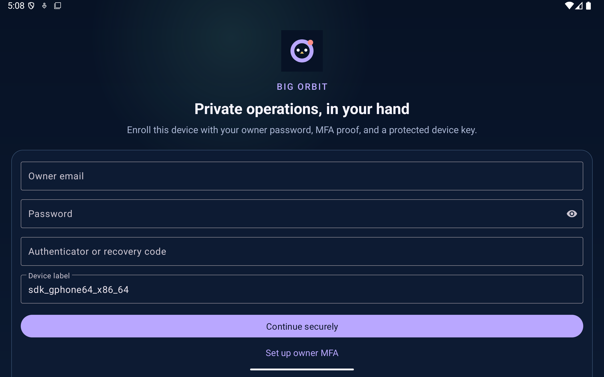

# Big Orbit

Big Orbit is the free, open-source Android owner console for
[Little Orbit](https://github.com/Captainpax/littleorbit). It moves administration out of
the public website and onto an explicitly enrolled device with a non-exportable Android
Keystore key.

[Big Orbit 1.0.0](https://github.com/Captainpax/big-orbit/releases/tag/v1.0.0) remains the published stable release with package `com.littleorbit.bigorbit`, version code 2, and an independent pinned signer. Source is aligned with [Little Orbit](https://github.com/Captainpax/littleorbit) on the 1.3.0 release train for an intended code-3 candidate. The candidate is not signed or published; its physical-device and production-compatibility gates remain open.

The app intentionally handles operational metadata only. It cannot browse relationship
notes, quiz answers, custom questions, precise locations, attachments, Smooch content, or
account exports.

## What is implemented

- Fresh-device password plus one-use terminal PIN bootstrap, followed by P-256 key proof. The first owner receives protected QR-based TOTP setup; later devices preserve existing MFA.
- Returning-device password plus TOTP/recovery authentication.
- P-256 Android Keystore enrollment and signed, one-use server challenges.
- A separately encrypted 90-day device credential and rotating 30-minute API sessions.
- Action inbox with question-report decisions, thresholded quiz ratings, AI run/policy,
  weekly-theme, reviewed-knowledge, public-context, and reserve observability, encrypted-backup evidence, typed operation requests, service health,
  registration control, bounded account/session actions, security events, and explicit revocation
  for either the current device or any other enrolled/pending key.
- First-party WorkManager polling with a generic lock-screen notification. No Firebase,
  hosted push broker, advertising SDK, or analytics SDK is present.
- A side-by-side `smoke` build named **Big Orbit QA** with package
  `com.littleorbit.bigorbit.smoke` and isolated Little Orbit smoke-stack URL.

## Build

Requirements: JDK 17 and Android SDK 37.

```powershell
python scripts\check_versions.py
python scripts\check_docs.py
.\gradlew.bat :app:testDebugUnitTest :app:assembleSmoke :app:lintSmoke
adb -s <serial> reverse tcp:18180 tcp:18180
```

The smoke package accepts only the fixed `http://127.0.0.1:18180/api` endpoint. The ADB
reverse tunnel keeps emulator and physical-device QA on the isolated local stack without
weakening the server's trusted-host policy.

Release builds deliberately require a signer that is independent from Little Orbit:

```text
BIG_ORBIT_SIGNING_STORE_FILE
BIG_ORBIT_SIGNING_STORE_PASSWORD
BIG_ORBIT_SIGNING_KEY_ALIAS
BIG_ORBIT_SIGNING_KEY_PASSWORD
```

Signer values and keystores must remain outside Git. An unsigned or debug-signed build is
never a production candidate.

Create a new local signer once (this refuses to overwrite an existing signer):

```powershell
.\scripts\create-local-signer.ps1
```

The release certificate is pinned independently through
`BIG_ORBIT_SIGNING_CERT_SHA256`. Build and verify one immutable candidate with:

```powershell
$env:BIG_ORBIT_SIGNING_ENV_FILE = "C:\protected\big-orbit-signing.env"
.\scripts\build-release.ps1 -DeviceSerial <adb-serial>
```

The verifier rejects the wrong package, version, or certificate, cold-launches the exact minified
APK when a device serial is supplied, and writes only public hash/size/certificate metadata under
the ignored `verification-output` directory.

## Visual baseline

The four sheets in [`docs/concepts`](docs/concepts) are high-resolution 1.2 concept imagery,
not production screenshots. The current Java/XML interface follows their navy, lavender,
coral, amber, orbital-line, and soft-glow system while keeping large touch targets and
dynamic Android text. The 1.3 setup flow reuses that baseline with a distinct PIN field,
protected authenticator QR, recovery-code acknowledgement, and richer metadata-only observatory.



This implementation capture is from the side-by-side smoke package on the 2560×1600 API 36
tablet emulator. It contains only simulated device information and no owner credentials.

## Server compatibility

Big Orbit 1.3.0 source targets Little Orbit 1.3.0's `/v2/admin` API; the published 1.0.0 app targets Little Orbit 1.2.0. There is no arbitrary command, SQL, URL, prompt, model option, or filesystem input in the operations contract. The public Little Orbit website does not host an administrator panel. See the [shared Little Orbit release note](https://github.com/Captainpax/littleorbit/blob/main/docs/releases/1.3.0.md), this repository's [candidate note](docs/releases/1.3.0.md), and [roadmap](ROADMAP.md).

Licensed under the [MIT License](LICENSE).
