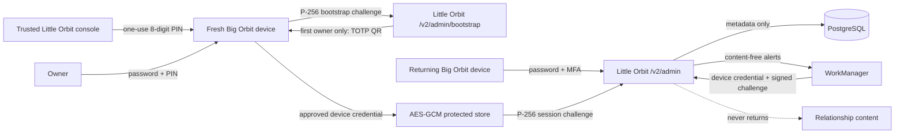

# Architecture

Every fresh device creates a non-exportable P-256 key before contacting Little Orbit. The server console prints one cryptographically generated PIN and persists only its domain-separated hash. Password plus PIN creates a pending device and a separate ten-minute bootstrap capability. That bearer can request status, prove the exact pending key with the `big-orbit:bootstrap:{challenge_id}:{challenge}` signature, and confirm first-owner MFA; it cannot access the ordinary owner console.

If no MFA factor exists, the API stages an encrypted TOTP secret and returns an authenticator URI plus server-rendered PNG QR. The protected app screen confirms one current code, displays recovery codes once, then receives the ordinary random device credential and 30-minute session. If MFA already exists, setup never returns or replaces its secret; key proof completes enrollment directly.

The encrypted bootstrap capability remains narrowly resumable until its original ten-minute expiry. If Android dies or the network loses the final completion response, the app requests a fresh single-use challenge, proves the same non-exportable key again, and receives rotated replacement credentials. A newly issued terminal PIN expires every older live setup capability, including this recovery window.

The ordinary device credential is shown to the app once, stored under Android Keystore AES-GCM, rotated through purpose-separated single-use P-256 challenges, and mapped to one approved non-revoked device. The native destinations consume only bounded service counters, account metadata, thresholded quiz intelligence, reviewed-knowledge/context/reserve health, weekly theme labels, run provenance, and redacted security events. Destructive account/session and registration actions use fixed typed endpoints with confirmation. Quiz regeneration is one fixed future-week operation. No route accepts commands, SQL, paths, URLs, prompt text, model options, or relationship content.

The app's `smoke` variant has a distinct package and fixed loopback URL. Release builds accept only `https://lil-orb.pax-kun.com/api`, require the independent Big Orbit signer, and must contain no QA label, endpoint, signer metadata, or bundled smoke artifact. The shared source version is checked through [`release-train.json`](../release-train.json); signing identities and APK bytes remain independent from [Little Orbit](https://github.com/Captainpax/littleorbit).
