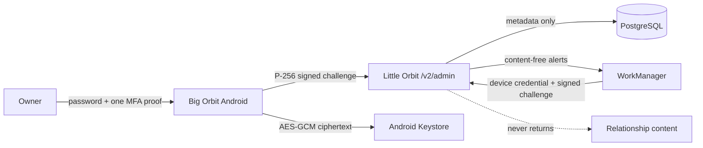

# Architecture

Initial enrollment creates a non-exportable P-256 key and sends only its SPKI public key.
The API issues a one-use, five-minute challenge. Big Orbit signs the exact
`big-orbit:{purpose}:{challenge_id}:{challenge}` bytes, then receives a random device
credential shown to the app once. Every short session is mapped to that exact approved device.

The app's `smoke` variant has a distinct package and the fixed emulator URL. Release builds
accept only `https://lil-orb.pax-kun.com/api` and require the independent Big Orbit signer.
